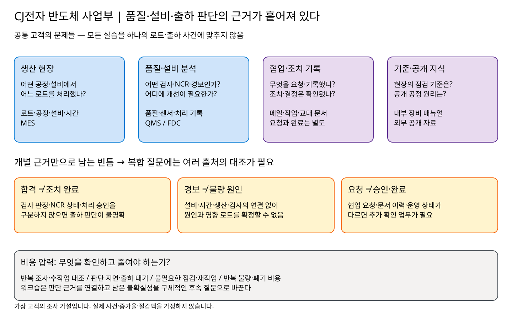
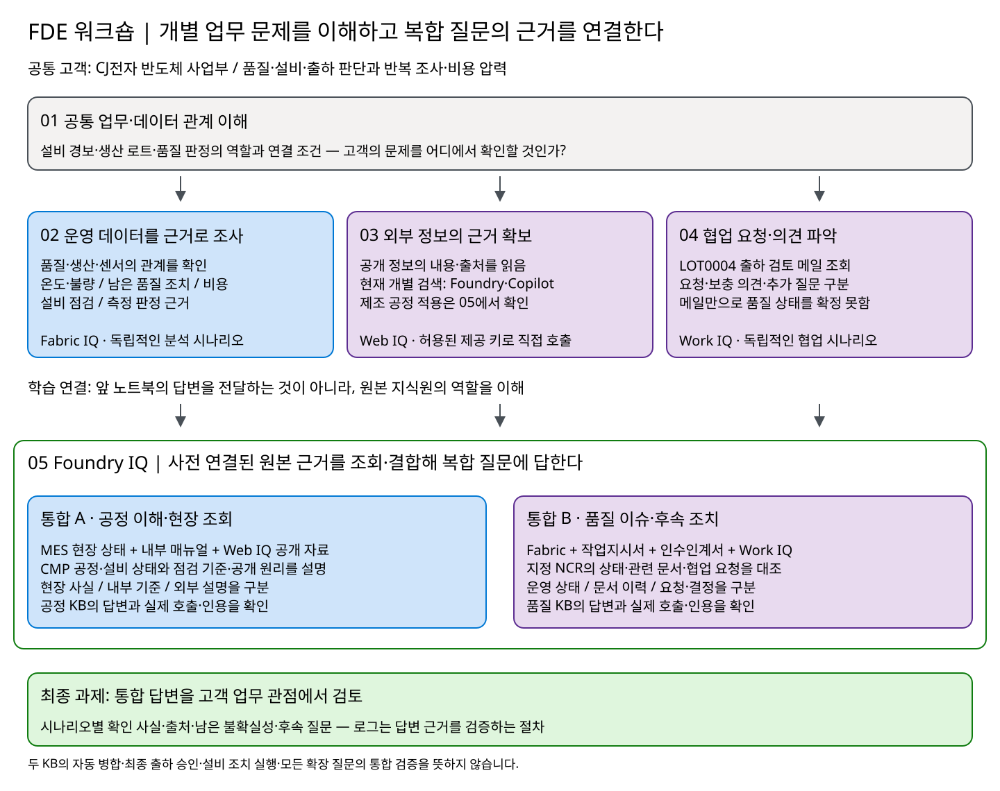

# CJ전자 반도체 사업부: 분산된 근거를 연결해 품질·설비·출하 판단의 불확실성을 줄이기

> **워크숍용 가상 고객 시나리오입니다.** CJ전자는 실습을 위한 가상 조직이며 실제 기업의 운영 상황을 설명하지 않습니다. 기존 Mock MES, 합성 품질·센서 데이터, 실습 문서와 메일을 사용합니다. 아래 문제는 조사할 업무 가설이며, 특정 로트의 불량·원인·미완료 조치나 비용 증가가 확인됐다는 뜻은 아닙니다.

## 1. 고객의 현재 상황

CJ전자의 제조 현장은 **MES(Manufacturing Execution System, 생산실행시스템)를 중심으로 여러 업무 시스템과 기록을 함께 활용하는 환경**입니다. MES는 어떤 로트가 언제 어떤 설비에서 어느 공정을 거쳤는지 보여주는 생산 운영의 기준점입니다. 이를 바탕으로 QMS의 검사·부적합·처리 상태, FDC의 설비 센서·경보, 장비 매뉴얼·정비 기록, Microsoft 365의 메일·협업 기록을 함께 확인합니다.

**모든 정보가 MES 하나에 모여 있는 것은 아닙니다.** 생산·품질·설비·협업 근거는 각 시스템에 나뉘어 있으므로, 같은 로트·설비·시간을 기준으로 연결해야 현장의 문제를 이해할 수 있습니다.

**[Mock MES 둘러보기 ↗](https://mock-mes.greenrock-bb44c93a.koreacentral.azurecontainerapps.io/)** — 워크숍에서 사용하는 MES 화면에서 로트·공정·설비·생산 이력을 먼저 살펴보세요.

CJ전자 반도체 사업부는 생산관리, 공정품질, 설비보전, 출하 운영 담당자가 협업해 생산·품질 문제를 조사하고 설비 점검과 로트 출하를 검토합니다. 각 부서는 자기 업무에 필요한 시스템과 기록을 갖고 있지만, **문제의 영향, 조치 상태와 개선 우선순위를 판단하는 근거는 여러 곳에 흩어져 있습니다.**

이 워크숍은 모든 실습을 하나의 출하 사건에 맞추지 않습니다. **01에서 공통 고객의 업무와 데이터 관계를 이해하고, 02~04에서 각각의 업무 시나리오를 실습한 뒤, 05 Foundry IQ에서 여러 영역의 근거가 필요한 복합 질문을 해결합니다.**

| 담당자 | 현재 확인하는 정보 | 혼자서는 답하기 어려운 질문 |
| --- | --- | --- |
| 생산관리 | MES의 로트·공정 경로·생산 이력·설비 | 품질 문제와 연관된 생산 공정은 무엇이며, 어느 로트까지 조사해야 하는가? |
| 공정품질·품질보증 | 검사·측정·규격·부적합 보고서(NCR)·처리 및 승인 상태 | 출하검사 결과와 이전 공정의 품질 조치를 함께 보면 무엇이 남아 있는가? |
| 설비보전 | 설비 센서·경보, 매뉴얼·정비 작업지시서·교대 인수인계서 | 경보 당시 어떤 생산이 진행됐으며, 점검 기록과 실제 상태가 일치하는가? |
| 출하 운영 | 출하 검토 메일·부서별 보충 의견 | 무엇이 요청이고 무엇이 확인된 사실이며, 추가 확인은 누구에게 요청해야 하는가? |

예를 들어 CMP는 웨이퍼 표면을 평탄화하는 공정입니다. CMP 압력 경보를 조사한다면 설비 신호만 볼 것이 아니라 **그 설비에서 언제 어떤 로트가 생산됐는지, 해당 생산과 연결된 검사가 무엇인지** 확인해야 합니다. 일반적인 공정 지식은 조사에 도움을 주지만, 특정 로트의 실제 원인을 대신 증명하지 않습니다.

*위 그림은 같은 고객 안에 분산된 업무 근거와 판단의 빈틈을 보여줍니다. 실제 반도체 공정 레시피나 하나의 사건 발생 순서를 확정한 그림이 아닙니다. [편집 가능한 그림 원본](assets/customer-problem.excalidraw)*

## 2. 고객의 페인포인트: 기록은 있지만 판단할 근거가 연결되지 않는다

| 페인포인트 | 발생하는 불확실성 | 확인·개선해야 할 비용 압력 |
| --- | --- | --- |
| 부서마다 로트·설비·검사 기록을 따로 조회한다 | 같은 로트의 다른 공정이나 다른 시점의 사건을 함께 해석할 수 있다 | 반복 조회, 수작업 대조, 부서 간 재확인에 드는 시간 |
| 출하검사 합격과 품질 조치 완료를 혼용한다 | 검사 합격만으로 출하 가능 여부를 판단하거나 남은 조치를 놓칠 수 있다 | 판단 지연에 따른 출하 대기와 재공 체류 가능성 |
| 센서 경보와 품질 불합격을 바로 연결한다 | 경보가 있었던 설비를 실제 불량 원인으로 성급하게 지목할 수 있다 | 불필요한 점검·재검사·재작업과 잘못된 조사 우선순위 |
| 메일의 요청, 문서의 조치 이력, 현재 운영 상태가 섞인다 | 요청을 완료로, 보충 의견을 승인으로 해석할 수 있다 | 중복 업무, 조치 누락, 담당 부서 간 조율 비용 |
| 폐기·재작업 사례의 생산 근거와 비용을 따로 본다 | 비용이 어느 공정·설비에 집중되는지, 같은 사례를 중복 집계했는지 알기 어렵다 | 개선 대상을 잘못 선정하고 반복 손실을 놓칠 가능성 |

이 워크숍에서 비용 증가율이나 절감액을 가정하지 않습니다. **어떤 불확실성이 어떤 비용으로 이어질 수 있는지 정의하고, 실제 기록에서 확인할 근거와 집계 기준을 정하는 것**이 먼저입니다.

## 3. 01~04: 공통 고객 안의 개별 업무 시나리오

각 실습은 독립적인 업무 질문과 확인 결과를 갖습니다. 앞 실습의 답변을 다음 실습의 입력으로 전달하는 연쇄 과정이 아닙니다. 개별 실습에서도 문제 해결 가치를 확인하고, 그 근거만으로 답할 수 없는 부분을 남깁니다.

| 실습 | 고객의 업무 질문·현재 실습 | 확인할 결과 | 해당 영역만으로 부족한 점 |
| --- | --- | --- | --- |
| [01 사내 제조 시스템](../01-inhouse-system/README.md) | 설비 경보, 당시 생산 로트, 검사·부적합은 각각 어디에서 확인하는가? | MES·QMS·FDC의 역할과 로트·설비·시간 연결 조건 | 데이터 관계를 이해한 것만으로 특정 사건의 영향이나 원인이 확인되지는 않음 |
| [02 Fabric IQ](../02-fabric-iq/README.md) | 검사·생산·부적합·센서를 연결하면 어떤 품질 사실과 개선 후보를 알 수 있는가? | 실제 관계·조회 결과·집계 기준·미확인 항목 | 운영 데이터만으로 부서의 협업 요청이나 문서상 정비 이력을 알 수 없음 |
| [03 Web IQ](../03-web-iq/README.md) | 공개 정보를 어떤 내용과 출처로 확보할 수 있는가? 현재는 Foundry·Copilot을 웹·이미지·동영상으로 조회 | REST·MCP의 실제 결과와 공개 근거 읽기 | 공개 자료는 내부 설비 상태·검사 판정·승인 상태를 증명하지 못함 |
| [04 Work IQ](../04-work-iq/README.md) | LOT0004 출하 검토 메일에서 부서들이 무엇을 요청했고 무엇을 추가 확인해야 하는가? | 요청·보충 의견·원문 링크·추가 운영 질문 | 메일만으로 생산·품질 수치나 조치 완료 여부를 확정할 수 없음 |

### Fabric에서는 여러 운영 문제를 각각 조사한다

기본 질문은 처리·승인, 검사·측정 담당 역할, 검사와 생산·설비 연결, 부적합의 발견 근거, 경보 이력 설비의 생산 이력을 확인합니다. [확장 A~E](../02-fabric-iq/helper-new/README-ontology-business-scenarios.md)는 다음과 같이 서로 다른 업무 목적을 갖습니다.

| 시나리오 | 고객의 문제 |
| --- | --- |
| A. 생산 온도와 불량 비교 | 불량 유형별 생산 온도와 함께 관측된 다른 불량을 비교하고 싶다 |
| B. 출하검사와 남은 품질 조치 | 출하검사 합격과 미완료 부적합·처리 승인 상태를 구분하고 싶다 |
| C. 재작업 실패와 폐기 비용 | 반복 불량과 폐기 비용이 집중되는 공정·설비를 찾고 싶다 |
| D. 설비 점검 우선순위 | 같은 제품·공정의 품질과 센서 경보를 비교해 점검 후보를 정하고 싶다 |
| E. 측정 판정 근거 | 재검사·측정값·규격·담당자 정보를 대조해 추가 확인 사항을 찾고 싶다 |

기본 질문 확인과 확장 질문 검증은 별개입니다. 확장 A~E는 아직 실행 미검증이며, 온도·집계·시간 구간 매칭 등을 각각 검증해야 합니다. 이 분석들을 모두 LOT0004 출하 검토의 선행 단계로 취급하지 않습니다.

### 협업과 외부 지식도 각각의 확인 목적을 갖는다

[기존 메일 10건](../04-work-iq/send-scenario-emails-prompt.md)은 Fabric의 확장 A~E에 각각 두 건씩 대응합니다. 다만 현재 Work IQ 노트북은 LOT0004 출하 검토 요청과 보충 의견 두 건에 집중하며, 나머지 메일 시나리오까지 모두 실행하는 것은 아닙니다. LOT0004·EQP-CMP01은 조회 단서이며 실제 불량·미완료 조치나 설비 귀속을 확정하지 않습니다.

Web IQ의 개별 실습은 현재 공개 제품 정보를 찾는 실습입니다. 제조 업무 적용은 05의 공정 조사에서 필요한 공개 기술 자료·유사 사례를 조회하는 것으로 다룹니다. 공개 자료는 **공정 원리와 조사 가설을 이해하는 보조 근거**, 내부 매뉴얼은 **해당 현장의 점검 기준**, 운영 데이터는 **기록된 발생 사실**입니다.

## 4. FDE 접근: 제품이 아니라 고객의 질문에서 시작한다

이 워크숍은 제품 메뉴나 API 목록을 외우는 과정이 아닙니다. **FDE(Forward Deployed Engineer) 관점에서 고객의 문제를 정의하고, 필요한 근거를 찾아 연결한 뒤, 기술이 그 문제 해결에 실제로 도움이 되는지 검증하는 과정**입니다.

| 접근 단계 | 참가자가 해야 할 일 | 남겨야 할 결과 |
| --- | --- | --- |
| 문제 정의 | 누가 무엇을 판단해야 하며, 무엇을 아직 모르는지 정리 | 업무 질문·판단 범위·미확인 항목 |
| 근거 설계 | 사실의 원장, 연결 키·시간축, 내부 기준과 협업 기록을 구분 | 질문별 필요한 출처와 연결 조건 |
| 작은 단위로 확인 | 각 출처를 조회하고 ID·시각·판정·인용을 대조 | 출처별 확인 사실과 조회 한계 |
| 근거 결합 | 05에서 복합 질문에 필요한 지식원을 조회하고 운영 사실·문서·요청·외부 설명을 구분 | 근거가 붙은 통합 답변 |
| 검증과 후속 조사 | 실제 호출·검색 입력·인용을 확인하고 누락·오류·충돌을 드러냄 | 남은 불확실성과 후속 확인 질문 |

*02~04는 독립적인 업무 시나리오입니다. 05의 연결은 앞 노트북의 답변 전달이 아니라 질문에 필요한 원본 지식원 조회를 뜻합니다. 두 KB 간 자동 연결·자동 승인 흐름은 아닙니다. [편집 가능한 그림 원본](assets/problem-solving-workshop.excalidraw)*

## 5. 05 Foundry IQ: 여러 근거가 필요한 복합 업무 질문을 해결한다

운영 데이터만으로는 부서의 요청을 알 수 없고, 메일만으로는 품질 상태를 확정할 수 없습니다. 매뉴얼만으로도 현재 설비 상태를 알 수 없습니다. [Foundry IQ 실습](../05-foundry-iq/README.md)은 이 빈틈을 해결하기 위해 **질문에 맞는 여러 지식원을 조회·결합하고 출처를 구분한 답변을 생성**합니다.

여기서 취합하는 것은 앞 노트북의 출력이나 개별 답변이 아니라 **원본 운영 데이터·문서·협업 기록·공개 자료의 근거**입니다. 개별 랩에서 각 영역을 이해한 뒤, 통합 랩에서 사전 연결된 소스에 복합 질문을 보냅니다.

### 통합 시나리오 A — 공정 이해·현장 조회

> MES에서 LOT0012 로트 상태를 확인하고, 현재 진행 중인 공정에서 이슈가 있는지 확인해보자. 만약 이슈가 있다면, 바로 직전 공정의 설비를 확인해서 해당 설비를 내부 장비 문서를 통해서 어떤 이슈가 있을법한지 검토해 보고, 이 이슈 사항이 웹 상에서 다른 회사에서도 문제가 발생했는지 퍼블릭하게 확인해서 전체적인 요약본을 제공해

| 필요한 근거 | 질문에서의 역할 |
| --- | --- |
| MES | LOT0012의 상태·현재 공정과, 이슈가 있을 때 바로 직전 공정의 실제 사용 설비 확인 |
| Blob의 내부 장비 매뉴얼 | 해당 설비의 이슈 가능성과 점검 기준을 검토할 내부 근거 |
| Web IQ | 확인된 공정·설비 문제를 공개 기술 용어로 바꾸어 조사할 공개 자료·유사 사례 |

공정 KB `process-assistance-kb-v2`를 사용합니다. 이슈 존재와 공정·설비는 MES 결과로 확인하며 CMP나 특정 원인을 미리 지정하지 않습니다. 조건에 해당하는 이슈가 없다면 후속 소스를 모두 호출하지 않을 수 있습니다. 공개 지식이 내부 점검 기준을 대신하거나 특정 로트의 실제 불량 원인을 증명하지 않습니다. 내부 식별자·매뉴얼 본문·비공개 기준값은 외부 검색에 보내지 않습니다.

KB 지침은 이러한 조회 원칙을 안내하는 것이지 강제 보안 필터가 아닙니다. 실제 외부 검색에 사용된 입력도 활동 로그에서 대조합니다.

### 통합 시나리오 B — 품질 이슈·후속 조치 조사

> LOT0004 / EQP-CMP01 / NCR-2026-0009의 후속 조치를 요약하세요. Fabric에서는 해당 NCR 한 건의 현재 상태를 확인하고, 작업지시서와 교대 인수인계서에서는 관련 조치 이력을, Work IQ의 IQ-DEMO-20260922 메일에서는 요청·결정·담당자를 확인하세요. 네 출처를 구분하고 없는 결정은 추측하지 마세요.

| 필요한 근거 | 질문에서의 역할 |
| --- | --- |
| Fabric | 해당 NCR의 운영·품질 상태 |
| 작업지시서 | 문서에 기록된 정비·조치 이력 |
| 교대 인수인계서 | 현장 관찰·후속 요청 이력 |
| Work IQ | `IQ-DEMO-20260922` 메일의 협업 요청·확인된 결정 기록 |

품질 KB `quality-investigation-kb-v2`를 사용합니다. 같은 로트·설비라는 이유만으로 다른 시점의 사건을 합치거나, 요청 메일을 승인·완료로 해석하지 않습니다. 문서에는 합성 자료와 의미 검수 전이라는 주의가 있으므로 운영 기록과의 일치 여부도 별도 확인합니다.

### 통합 범위와 검증을 구분한다

위 두 질문은 공정·품질 KB의 대표 질문입니다. 현재 [05 호출 노트북](../05-foundry-iq/kb_retrieve_test.ipynb)에는 공정 2개·품질 2개, 총 4개의 호출 질문이 있으며, 질문이 들어 있다는 사실과 실제 응답 검증은 구분합니다. 공정 추가 질문은 제품창고의 로트를 찾는 작성 중 문구이고, 품질 추가 질문은 메일에서 조사 대상을 찾아 품질·센서·작업·인수인계 기록을 살펴보는 확장 조사입니다. 최신 문구와 실행 상태는 05 안내와 노트북을 기준으로 합니다.

각 KB 안에서 여러 출처를 결합하지만, **두 KB의 답변을 자동으로 합치는 에이전트는 없습니다.** 위의 품질 대표 질문은 지정한 NCR 한 건의 후속 조사이며 출하검사·관련 NCR 전체·최종 출하 승인을 자동으로 확인하지 않습니다. 추가 질문의 존재가 Fabric의 확장 A~E 전체를 Foundry에서 통합 검증했다는 뜻도 아닙니다.

[01의 데이터 관계](../01-inhouse-system/data-relationship.md)는 설비·생산·품질을 연결하는 업무 원리를 설명합니다. 그 문서의 FDC → MES → QMS 전체 조사 흐름을 위 두 질문이 모두 실행·검증했다고 확대하지 않습니다.

로그·인용 분석은 **통합 답변이 고객의 질문을 실제 근거로 해결했는지 검증하는 절차**입니다. 실제 검색 입력·소스 호출·추가 조회·오류·인용을 대조하되, 반환되지 않은 내부 추론 전문이나 재검색 이유는 만들지 않습니다. 개별 질문의 성공을 모든 업무 질문에서 자동 소스 선택이 검증됐다는 뜻으로 확대하지 않습니다.

## 6. 최종 통합 과제와 완료 기준

### 과제: Foundry의 두 통합 답변을 고객 업무 관점에서 검토한다

05의 [호출 노트북](../05-foundry-iq/kb_retrieve_test.ipynb)에서 통합 시나리오 A·B를 각각 실행하고 답변·인용·활동 로그를 분석합니다. 앞 랩의 모든 답변을 수동으로 모아 하나의 출하 보고서로 만드는 과제가 아닙니다. 참가자는 Foundry가 결합한 근거가 질문에 충분한지 검토하며, **시나리오별 확인 사실·남은 불확실성·후속 질문**을 남깁니다.

| 순서 | 수행할 일 | 남길 근거 |
| --- | --- | --- |
| 1. 질문별 근거 설계 | A·B 각각의 업무 질문과 필요한 출처, 조회 전 가정·미확인 항목을 적음 | 소스별로 기대하는 확인 항목 |
| 2. 통합 질문 실행 | 05의 공정 KB와 품질 KB를 각각 호출. 두 결과를 자동 연결하거나 다른 랩 출력으로 대체하지 않음 | 각 KB의 실제 답변·응답 상태 |
| 3. 근거 대조 | 실제 호출 소스·검색 입력·인용을 확인하고, 출처별 주장·자료 시점·상태·충돌을 구분 | 활동·인용 ID, 확인된 사실, 오류·누락 |
| 4. 고객에게 설명 | A는 현장 사실·내부 기준·외부 설명, B는 운영 상태·문서 이력·협업 요청을 구분해 검토 요약 작성 | 시나리오별 확인 상태·남은 불확실성·후속 확인·고객 가치 평가 |

필요한 출처에 접근할 수 없으면 저장된 실제 출력의 범위를 밝히고 분석하며, 수행하지 못한 조회를 수행한 것으로 기록하지 않습니다. 추가 분석은 해당 개별 랩의 후속 질문으로 별도 수행하거나 미확인 과제로 남깁니다. 설비 경보 당시의 영향 로트를 주장하려면 설비 ID와 실제 생산 시간 구간의 센서 관측을 대조해야 합니다. 02의 기본 질문 4에서 경보 이력 설비의 생산 목록을 얻었다는 사실만으로 그 연결을 확정하지 않습니다.

**작성 형식:** 통합 시나리오 A·B에서 확인할 업무 항목마다 아래 내용을 기록합니다. 가상의 결과를 채우는 양식이 아니라 실제 응답의 근거를 정리하는 기준입니다.

| 항목 | 기록할 내용 |
| --- | --- |
| 업무 질문 | 고객이 판단해야 하는 내용과 조회 범위 |
| 확인된 사실·근거 | 실제 값, 원본 ID·출처 또는 인용 링크, 조회 환경·자료 시점 |
| 확인 상태 | 확인됨 / 조건 해당 없음 / 부분 확인 / 조회 실패 중 하나와 그 근거 |
| 남은 불확실성 | 미조회·연결 불가·자료 충돌 및 원인 가설. 조회하지 않은 항목은 부분 확인의 이유로 명시 |
| 후속 확인 | 확인할 부서 또는 확인된 담당자, 필요한 자료·추가 질문 |
| 비용 검토 | 이번 질문과 관련된 비용 항목·집계 기준. 금액 근거가 없으면 미확인으로 기록 |

### 완료 기준

최종 결과는 “출하를 승인했습니다”가 아니라 다음 항목이 담긴 **근거 기반 검토 요약**입니다.

- **확인된 사실:** 각 시나리오에서 조회한 공정·설비·기준·NCR 등 필요한 기록을 실제 식별자와 출처로 설명한다. 조회하지 않은 검사·처리 기록은 만들지 않는다.
- **업무 맥락:** 운영 사실·내부 기준·공개 설명을 구분하고, 협업 기록의 요청과 확인된 결정·완료 기록을 구분한다.
- **남은 불확실성:** 미조회·연결 불가·자료 충돌·부분 실패를 숨기지 않는다.
- **후속 확인:** 어느 부서에 어떤 자료나 확인을 요청할지 정리한다. 메일에서 확인되지 않은 실제 담당자를 임의로 지정하지 않는다.
- **비용 검토:** 반복 조사·출하 대기·재작업·폐기 중 무엇을 확인할지 정하고, 데이터가 있는 비용은 중복 없는 집계 기준을 밝힌다. 조회하지 않은 절감 효과를 주장하지 않는다.
- **검증 근거:** 답변의 인용과 실제 호출 로그를 대조한다. HTTP 성공만으로 업무 질문이 해결됐다고 판단하지 않는다.

출하 승인, 설비 정지, 로트 Hold, 재작업·폐기는 권한 있는 담당자의 업무 결정입니다. 이번 워크숍은 이러한 조치를 자동 실행하지 않습니다.

**요약 작성 완료와 고객 문제 해결 완료는 다릅니다.** 필요한 근거가 남아 있다면 과제 결과는 부분 확인이며, 공정 조사나 품질 후속 검토를 완료했다고 표현하지 않습니다. 불확실성을 구체적인 후속 업무로 바꾸는 것도 학습 결과이지만, 실패한 조회를 성공으로 바꾸는 것은 아닙니다.

### 고객 가치 평가: 기술 사용 전후 무엇이 달라졌는가?

각 개별 시나리오는 자체 질문에 답했는지 평가하고, 05의 통합 시나리오는 서로 다른 근거를 연결해 추가로 무엇을 확인했는지 평가합니다. 조회 전 작성한 질문·가정·미확인 항목과 최종 요약을 비교하되, 실제 업무의 시간·비용 절감 효과를 입증하는 평가는 아닙니다.

| 고객의 문제 | 관찰할 평가 기준 |
| --- | --- |
| 부서별 설명을 재확인하기 어렵다 | 최종 요약의 사실 주장마다 출처와 자료 시점이 있는가? 없는 주장은 미확인으로 표시했는가? |
| 성격이 다른 근거를 혼동한다 | A의 현장 사실·내부 기준·외부 설명, B의 운영 상태·문서 이력·협업 요청을 구분했는가? 조회한 경우 판정·승인·완료도 구분했는가? |
| 로트·설비가 같으면 같은 사건으로 본다 | 실제 관계·시간 조건을 확인했는가? 확인하지 못한 연결은 명시했는가? |
| 추가 조사 범위가 모호하다 | 남은 질문마다 확인할 부서·필요 자료·후속 질문이 있는가? |
| 답변이 맞는지 재검토하기 어렵다 | 실행한 조회의 검색 입력·인용·오류를 대조했는가? 미실행 조회를 표시했는가? |
| 비용을 추정하거나 중복 집계한다 | 비용 근거가 있으면 종류·고유 ID·범위·중복 제거 기준을 밝혔는가? 없으면 금액과 절감액을 만들지 않았는가? |

각 기준을 **충족 / 미충족 / 평가 불가**로 표시하고 근거를 남깁니다. 최초의 미확인 질문이 최종적으로 확인됨·조건 해당 없음·후속 확인 과제로 어떻게 바뀌었는지도 비교합니다. 평가 불가를 충족으로 계산하거나, 근거가 늘었다는 이유만으로 사업 비용이 절감됐다고 주장하지 않습니다.

## 7. 시작 전 확인

### 참가자별 구축과 진행자 제공 항목을 구분한다

워크숍은 참가자 각자의 계정·리소스 그룹·실습 리소스 구축을 원칙으로 합니다. 20명이면 20개의 참가자 환경을 구분합니다. Fabric 작업 영역과 M365 권한은 Azure 리소스 그룹과 별도로 준비하며, 사용자 수가 같다고 테넌트도 모두 다르다고 가정하지 않습니다. 앞 실습의 리소스나 답변은 다음 실습에 자동 등록되지 않습니다.

| 실습 | 진행 방식 | 환경과 근거의 경계 |
| --- | --- | --- |
| 01 | 업무·데이터 관계 이해 | 제공된 Mock MES와 설명 자료에서 질문별 원장을 파악 |
| 02 | 권한을 갖춘 참가자의 직접 구축·조회 | 참가자 작업 영역의 Lakehouse·Eventhouse·온톨로지와 직접 연결한 Data Agent 사용 |
| 03 | 진행자가 제공한 실습 키로 참가자 직접 호출 | 고객 실습·키 제공 허용을 먼저 확인. 포털 시연·키 발급은 진행자가 담당하며 키 미제공 시 저장 출력 분석으로 한정 |
| 04 | 권한·앱 등록·메일 준비 후 직접 조회 | 로그인한 사용자가 접근할 수 있는 실습 메일 사용. 두 질문의 실제 조회 경로는 별도 실행 검증 필요 |
| 05 | 각자의 KB·KS 구성 후 통합 조회·근거 검증이 목표 | 현재 도우미는 기존 정의·연결을 재사용하므로 빈 환경의 전체 구축 절차는 미완성. 진행자 검증 기록과 참가자 준비를 구분 |

Web IQ 키는 참가자의 사용자 인증을 대체하지 않습니다. 각 참가자는 자신의 KS에 제공 키를 설정하고, KB 호출은 자신의 MSAL 토큰으로 수행합니다. 공동 키를 사용하더라도 KB·KS를 공유하는 것은 아닙니다.

02번에서 새로 만든 온톨로지·Data Agent가 05번에 자동 연결되는 것은 아닙니다. 진행자는 02·05의 작업 영역·Data Agent·소스 및 데이터 기준 시점을 대조해 **같은 환경인지, 같은 실습 이력인지, 비교 가능한 별도 환경인지**를 먼저 안내합니다. 이름이나 로트 ID가 같다는 이유만으로 같은 스냅샷이라고 가정하지 않습니다.

별도 환경이면 결과를 구분해 기록합니다. 연결·시간 기준을 확인하지 못한 결과는 한 사건의 근거로 합치지 않으며, 이번 워크숍을 위해 기존 연결을 임의로 변경하지 않습니다.

### 권한·검증·비용·정리

- 각 실습 안내에서 계정·권한·라이선스·앱 등록·조회 소스와 실행 환경을 준비합니다. 고객 데이터 대신 제공된 실습 자료를 사용합니다.
- MES·QMS·FDC는 같은 MES 이력과 시간 기준으로 연결합니다. 같은 ID만으로 같은 사건이라고 판단하지 않습니다.
- Web IQ는 사용이 허용된 진행자 제공 키로 참가자가 직접 호출합니다. 키 미제공 시에는 저장 출력 분석 범위를 명시합니다. 진행자는 동시 호출량·할당량과 종료 후 행사 키 폐기를 관리합니다. 외부 검색에는 공개 기술 용어만 보내며 내부 식별자·매뉴얼 본문·기준값을 보내지 않습니다. KB 지침은 보안 필터가 아니므로 실제 외부 검색 입력도 확인합니다.
- Work IQ 직접 REST 로그인·질문 경로와 Foundry의 Work IQ 연결은 별도로 확인합니다. 한 경로의 성공을 다른 경로의 검증으로 간주하지 않습니다.
- 고객 진행 전에는 [Fabric 안내](../02-fabric-iq/README.md)의 실제 사용할 기본·확장 질문, Work IQ 직접 REST의 두 질문, 02·05의 소스 대응과 참가자별 신규 구축 절차를 별도로 점검합니다. 이번 문서 보완이 원격 실행·연결·배포 검증 완료를 뜻하지는 않습니다.
- 모델·검색·API 호출과 Fabric 용량은 비용을 발생시킬 수 있습니다. 실행 전 사용 조건을 확인하고 종료 후 세션·예약·유료 리소스의 정리 여부를 확인합니다.
- 실행 출력에 내부 기록·URL이 포함될 수 있습니다. 토큰·키를 저장하거나 공유하지 않고, 노트북 공유 전 소스와 출력을 점검합니다.

**[01 사내 제조 시스템에서 시작하기](../01-inhouse-system/README.md)** · [전체 실습 목록](../../README.md)
