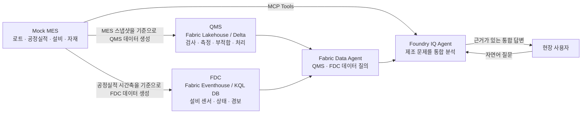

# 01. 사내 제조 시스템: 고객의 문제를 어디에서 확인할 것인가?

## 고객 상황과 이 랩을 하는 이유

[CJ전자 반도체 사업부](../00-getting-started/README.md)의 설비 엔지니어가 CMP 압력 경보를 조사하려고 합니다. 생산관리자는 당시 처리된 로트를, 품질 담당자는 검사와 부적합을 알아야 합니다. 하지만 어느 시스템에서 어떤 사실을 확인해야 하는지부터 합의되지 않으면 부서마다 다른 기록을 보고 판단할 수 있습니다.

이 랩은 **생산·품질·설비 기록의 역할과 연결 조건을 이해하는 독립 실습**입니다. 가상 고객의 조사 상황이며, 경보나 불량이 특정 로트에서 실제 발생했다고 미리 확정하지 않습니다.

## 이번 랩의 업무 질문

> “설비 경보가 품질에 영향을 줬는지 조사하려면, 어느 시스템에서 어떤 기록을 찾아 어떻게 연결해야 하는가?”

| 참가자가 할 일 | 남길 산출물 |
| --- | --- |
| 제공된 [Mock MES](https://mock-mes.greenrock-bb44c93a.koreacentral.azurecontainerapps.io/)에서 로트·공정·설비·생산 이력의 의미 확인 | MES에서 확인할 수 있는 사실 목록 |
| 아래 역할표와 [데이터 관계](data-relationship.md)를 읽고 경보·생산·검사 질문을 분리 | 업무 질문 → 원장 시스템 대응표 |
| 로트 ID, 공정, 설비 ID와 생산 시간 구간의 연결 조건 설명 | 서로 다른 기록을 같은 사건으로 연결하기 위한 조건 |

**완료 기준:** FDC 경보만으로 불량을, 검사 불합격만으로 설비 원인을 확정할 수 없는 이유와 추가로 필요한 근거를 설명할 수 있어야 합니다. 이 랩에서 출하 승인·설비 정지·원인 확정은 수행하지 않습니다.

## 이 시나리오에서 풀 문제

현장에서 "어떤 로트가 왜 불량이 났는가"를 알아내려면 한 시스템만 봐서는
부족합니다.

- MES는 어떤 로트가 어느 공정을 언제 어떤 설비에서 거쳤는지 압니다.
- QMS는 검사 결과, 실측값, 부적합과 처리 결정을 압니다.
- FDC는 그 시각의 설비 센서값과 경보를 압니다.

예를 들어 CMP 설비의 `PAD_PRESSURE` 경보가 발견되면, MES에서 같은 설비와
시간대의 로트를 찾고 QMS에서 그 로트의 검사와 부적합 이력을 확인해야 원인을
추적할 수 있습니다.

## 세 시스템의 역할

| 시스템 | 업무 역할 | 저장소와 접근 방식 | 답할 수 있는 질문 |
| --- | --- | --- | --- |
| Mock MES | 생산 운영 시스템 | 웹 애플리케이션, REST/OpenAPI, MCP Tools | 어느 로트가 언제 어떤 설비에서 어떤 공정을 수행했는가? |
| QMS | 품질 관리 시스템 | Microsoft Fabric Lakehouse의 Delta 테이블 | 검사 결과는 무엇이며, 규격 이탈과 부적합은 어떻게 처리됐는가? |
| FDC | 설비 데이터 수집 시스템 | Microsoft Fabric Eventhouse의 KQL DB | 설비가 그 시각에 어떤 센서값과 경보 상태였는가? |

QMS와 FDC는 [02 Fabric 실습](../02-fabric-iq/README.md)에서 참가자가 자신의 작업 영역에 준비합니다. 현재 실습은 `factory_lakehouse`의 `mes`·`qms` 스키마와 별도 `fdc_eventhouse`를 사용합니다. 이 랩의 시스템 구분은 업무 원장의 구분이며, MES·QMS 스냅샷이 같은 Lakehouse에 적재되는 것과 모순되지 않습니다.

### 현장 역할과 의사결정

| 담당자 | 주 시스템 | 시스템에서 확인하는 업무 사실 | 다음 의사결정 |
| --- | --- | --- | --- |
| 생산관리자 | MES | 로트의 공정 경로, 현재 WIP, 설비별 공정실적, 생산 수량 | 로트를 계속 진행할지, Hold할지, 대체 설비로 보낼지 결정 |
| 설비 엔지니어 | FDC | 가동 중 설비의 센서값, 경고·경보 시각, 설비 상태 | 설비를 점검할지, 레시피·부품을 확인할지, 추가 생산을 멈출지 결정 |
| 품질 엔지니어 | QMS | 검사 규격, 실측값, 합격/불합격 판정, NCR, 처리 결정 | 영향을 받은 로트를 격리할지, 재검사·재작업·폐기 중 무엇을 선택할지 결정 |

이후 Data Agent에 등록된 업무 관계를 통해 생산과 검사·부적합을 함께 조회합니다. 여기서는 다른 참가자나 진행자의 기존 작업 영역을 자신의 실습 환경으로 가정하지 않습니다.

## 대표 업무 시나리오: CMP 압력 이상과 품질 영향

반도체 웨이퍼의 CMP(평탄화) 공정에서는 패드 압력이 높으면 웨이퍼 표면에
`Scratch`가 발생할 수 있습니다. 이 시나리오에서 중요한 것은 FDC의 경보 자체가
불량 판정이 아니라는 점입니다. 경보는 설비 이상 신호이고, 생산 영향은 MES에서,
품질 영향과 처분은 QMS에서 확인합니다.

| 순서 | 시스템 | 현장 사건과 확인 내용 | 업무 결과 |
| --- | --- | --- | --- |
| 1 | FDC | `EQP-CMP01`의 `PAD_PRESSURE`가 `Alarm` 상태가 된 시각을 탐색 | 설비 엔지니어가 이상 구간과 점검 대상을 식별 |
| 2 | MES | 같은 `eqp_id`와 시간 범위의 공정실적에서 처리 중이던 `lot_id`, 공정 단계, 생산 결과를 확인 | 생산관리자가 영향을 받은 재공 로트를 식별하고 Hold 후보를 결정 |
| 3 | QMS | 해당 `lot_id`의 검사 실측값, `Scratch` 관련 판정, NCR, 처리 결정을 확인 | 품질 엔지니어가 격리, 재검사, 재작업 또는 폐기 결정을 뒷받침 |
| 4 | 후속 통합 검토 | 생산·설비·품질 근거와 필요한 문서·협업 기록을 함께 검토 | 확인 사실과 추가 조사 항목을 구분. 조치 실행은 담당자 결정 |

## 후속 통합의 개념도

아래는 업무 시스템 간 연결 원리를 설명합니다. 01에서 에이전트를 구축한다는 뜻이나, 05의 현재 질문들이 FDC → MES → QMS 전체 조사 흐름을 검증했다는 뜻은 아닙니다.

세 시스템은 같은 데이터를 복제하는 구조가 아닙니다. MES는 운영 사실의 원본이고,
QMS와 FDC는 각자의 업무에 필요한 정보를 별도로 보관합니다. 따라서 분석 에이전트는
질문에 따라 알맞은 시스템을 선택하고 결과를 연결해야 합니다.

## 해결 범위와 Foundry에서의 연결

이 랩에서 해결하는 문제는 **조사 질문과 근거 위치의 불명확성**입니다. 원장과 연결 조건을 정리하지만 실제 원인이나 조치 완료 여부까지 확인한 것은 아닙니다.

[05 Foundry IQ](../05-foundry-iq/README.md) 신규 실습에서는 MES 현장 정보와 매뉴얼을 결합하거나, Fabric 품질 상태와 문서·협업 기록을 결합합니다. Web IQ 공개 지식까지 연결한 기존 구성은 [발표자용 데모](../06-hostedagent/README.md#발표자용-기존-kb-구성)에서 구분해 설명합니다. 01에서 정리한 사실의 경계는 그 통합 답변을 검토하는 기준이 됩니다. 앞 실습의 답변을 복사해 합치는 방식은 아닙니다.

## 다음 단계

1. [데이터 관계와 교차 분석 흐름](data-relationship.md)에서 시스템별 연결 키와
   시간축 규칙을 확인합니다.
2. [02 Fabric IQ](../02-fabric-iq/README.md)에서 자신의 데이터와 업무 관계를 준비하고 운영 질문을 확인합니다.
3. [03 Web IQ](../03-web-iq/README.md)와 [04 Work IQ](../04-work-iq/README.md)에서 외부 근거와 협업 맥락을 각각 확인합니다.
4. [05 Foundry IQ](../05-foundry-iq/README.md)에서 여러 지식원의 근거를 결합하고 한계를 검토합니다.

이 랩의 개념 확인만으로 리소스를 생성·변경하지 않습니다. Mock MES의 제공 주소·키를 사용하고 공유 환경을 재시드하거나 다른 참가자의 이력을 바꾸지 않습니다.