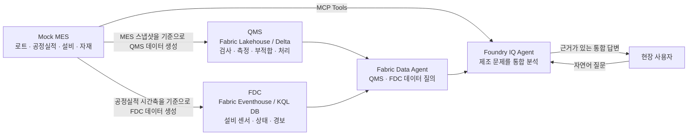

# 사내 제조 시스템 개요

이 시나리오는 반도체 Fab의 생산, 품질, 설비 데이터를 서로 다른 시스템에서
확인하고 하나의 질문으로 연결하는 과정입니다. 시작점은
[Mock MES](https://mock-mes.greenrock-bb44c93a.koreacentral.azurecontainerapps.io/)입니다.

## 이 시나리오에서 풀 문제

현장에서 "어떤 로트가 왜 불량이 났는가"를 알아내려면 한 시스템만 봐서는
부족합니다.

- MES는 어떤 로트가 어느 공정을 언제 어떤 설비에서 거쳤는지 압니다.
- QMS는 검사 결과, 실측값, 부적합과 처리 결정을 압니다.
- FDC는 그 시각의 설비 센서값과 경보를 압니다.

예를 들어 CMP 설비의 `PAD_PRESSURE` 경보가 발견되면, MES에서 같은 설비와
시간대의 로트를 찾고 QMS에서 그 로트의 검사와 부적합 이력을 확인해야 원인을
추적할 수 있습니다.

## 세 시스템의 역할

| 시스템 | 업무 역할 | 저장소와 접근 방식 | 답할 수 있는 질문 |
| --- | --- | --- | --- |
| Mock MES | 생산 운영 시스템 | 웹 애플리케이션, REST/OpenAPI, MCP Tools | 어느 로트가 언제 어떤 설비에서 어떤 공정을 수행했는가? |
| QMS | 품질 관리 시스템 | Microsoft Fabric Lakehouse의 Delta 테이블 | 검사 결과는 무엇이며, 규격 이탈과 부적합은 어떻게 처리됐는가? |
| FDC | 설비 데이터 수집 시스템 | Microsoft Fabric Eventhouse의 KQL DB | 설비가 그 시각에 어떤 센서값과 경보 상태였는가? |

QMS와 FDC는 Fabric Capacity `fabriccjmenufacturing`에서 사용하는 데이터
저장소입니다. 로그인한 계정 기준으로 이 Capacity는 Central US의 F2 SKU이며
정상 상태로 확인했습니다. 이 문서에서는 포털에서 직접 확인하지 않은 개별
Lakehouse와 Eventhouse 항목 이름을 가정하지 않고 역할로만 구분합니다.

### 현장 역할과 의사결정

| 담당자 | 주 시스템 | 시스템에서 확인하는 업무 사실 | 다음 의사결정 |
| --- | --- | --- | --- |
| 생산관리자 | MES | 로트의 공정 경로, 현재 WIP, 설비별 공정실적, 생산 수량 | 로트를 계속 진행할지, Hold할지, 대체 설비로 보낼지 결정 |
| 설비 엔지니어 | FDC | 가동 중 설비의 센서값, 경고·경보 시각, 설비 상태 | 설비를 점검할지, 레시피·부품을 확인할지, 추가 생산을 멈출지 결정 |
| 품질 엔지니어 | QMS | 검사 규격, 실측값, 합격/불합격 판정, NCR, 처리 결정 | 영향을 받은 로트를 격리할지, 재검사·재작업·폐기 중 무엇을 선택할지 결정 |

`qms_lakehouse`는 Fabric 작업 영역 `IQ-Fabric-Workshop`에서 확인한 QMS
Lakehouse입니다. 이 항목은 Data Agent에 추가할 수 있으므로, 품질 엔지니어의
검사·부적합 이력을 Foundry IQ의 교차 분석에 제공합니다.

## 대표 업무 시나리오: CMP 압력 이상과 품질 영향

반도체 웨이퍼의 CMP(평탄화) 공정에서는 패드 압력이 높으면 웨이퍼 표면에
`Scratch`가 발생할 수 있습니다. 이 시나리오에서 중요한 것은 FDC의 경보 자체가
불량 판정이 아니라는 점입니다. 경보는 설비 이상 신호이고, 생산 영향은 MES에서,
품질 영향과 처분은 QMS에서 확인합니다.

| 순서 | 시스템 | 현장 사건과 확인 내용 | 업무 결과 |
| --- | --- | --- | --- |
| 1 | FDC | `EQP-CMP01`의 `PAD_PRESSURE`가 `Alarm` 상태가 된 시각을 탐색 | 설비 엔지니어가 이상 구간과 점검 대상을 식별 |
| 2 | MES | 같은 `eqp_id`와 시간 범위의 공정실적에서 처리 중이던 `lot_id`, 공정 단계, 생산 결과를 확인 | 생산관리자가 영향을 받은 재공 로트를 식별하고 Hold 후보를 결정 |
| 3 | QMS | 해당 `lot_id`의 검사 실측값, `Scratch` 관련 판정, NCR, 처리 결정을 확인 | 품질 엔지니어가 격리, 재검사, 재작업 또는 폐기 결정을 뒷받침 |
| 4 | Foundry IQ | MES MCP Tools와 Fabric Data Agent의 근거를 하나의 답변으로 정리 | 담당자가 설비 조치와 로트 품질 조치를 같은 맥락에서 수행 |

## 시스템 연계도

세 시스템은 같은 데이터를 복제하는 구조가 아닙니다. MES는 운영 사실의 원본이고,
QMS와 FDC는 각자의 업무에 필요한 정보를 별도로 보관합니다. 따라서 분석 에이전트는
질문에 따라 알맞은 시스템을 선택하고 결과를 연결해야 합니다.

## 이 핸즈온의 목표

이 핸즈온의 목표는 Foundry IQ가 다음 두 접근 경로를 함께 사용하도록 만드는 것입니다.

1. **MES MCP Tools**로 현재 운영 이력과 마스터 데이터를 조회합니다.
2. **Fabric Data Agent**로 Lakehouse의 QMS 데이터와 Eventhouse의 FDC 데이터를
   분석합니다.

이 조합으로 Foundry IQ는 설비 경보, 생산 이력, 품질 판정을 하나의 조사 흐름으로
연결합니다. 이후 Work IQ의 업무 컨텍스트와 Web IQ의 외부 정보를 더하면, Microsoft IQ
Series 전체 데모에서 제조 현장의 질문을 근거와 함께 답하는 통합 시나리오가 됩니다.

## 다음 단계

1. [데이터 관계와 교차 분석 흐름](data-relationship.md)에서 시스템별 연결 키와
   시간축 규칙을 확인합니다.
2. Fabric IQ 실습에서 QMS Lakehouse 데이터를 적재해 품질 데이터를 준비합니다.
3. Fabric IQ 실습에서 FDC Eventhouse 데이터를 적재해 설비 시계열 데이터를
   준비합니다.
4. Foundry IQ 실습에서 MES MCP Tools와 Fabric Data Agent를 에이전트에 연결합니다.