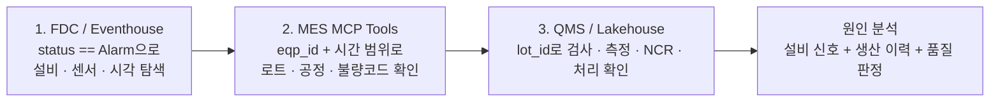

# 데이터 관계와 교차 분석 흐름

이 문서는 [사내 제조 시스템 개요](README.md)에서 소개한 Mock MES, QMS, FDC가
어떤 데이터로 이어지는지 설명합니다. 이 관계를 이해하면 Foundry IQ 에이전트가
질문마다 왜 여러 도구를 호출하는지 알 수 있습니다.

## 시스템별 원장

| 시스템 | 원장으로 관리하는 사실 | 대표 데이터 |
| --- | --- | --- |
| Mock MES | 생산 흐름과 공정 실행 | 로트, 제품, 자재, 공정실적, 설비, WIP |
| QMS | 품질 판정과 후속 조치 | 검사 기준, 검사, 측정값, 입고검사, 부적합, 처리 결정 |
| FDC | 설비의 시계열 상태 | 센서 판독값, `run_status`, `status` 경보 상태, 센서 규격 |

각 시스템은 독립적인 업무 목적을 갖습니다. 세 시스템 사이에는 데이터베이스
외래 키가 없으므로, 에이전트와 분석자는 아래의 비즈니스 키를 사용해 결과를
연결합니다.

### 같은 사건을 세 시스템에 나누어 묻는 이유

"CMP 압력 경보가 품질 문제를 일으켰는가?"는 하나의 질문처럼 보이지만, 실제로는
서로 다른 업무 질문 네 개입니다.

| 업무 질문 | 답해야 하는 시스템 | 근거 | 의사결정에 쓰는 방식 |
| --- | --- | --- | --- |
| 경보는 실제로 언제, 어느 센서에서 발생했는가? | FDC | `eqp_id`, `sensor_code`, `reading_ts`, `status` | 설비 점검과 이상 구간 확정 |
| 그때 어떤 로트가 설비에서 처리됐는가? | MES | `eqp_id`, `in_time`, `out_time`, `lot_id`, `step_code` | 영향 로트와 공정 범위 확정 |
| 그 로트가 검사 규격을 벗어났는가? | QMS | 검사 기준, 실측값, 검사 판정 | 품질 영향 확인 |
| 영향 로트를 어떻게 처리할 것인가? | QMS + MES | NCR, 처리 결정, 현재 WIP와 생산 상태 | Hold, 재검사, 재작업, 폐기 또는 생산 재개 결정 |

FDC의 경보만으로 불량을 단정하거나, QMS의 불합격만으로 설비 원인을 단정하지
않습니다. MES가 두 시스템의 같은 생산 사건을 연결하는 기준점을 제공합니다.

## 데이터 연결 키와 시간축

### MES와 QMS

QMS는 생산 결과를 중복 보관하지 않습니다. 예를 들어 QMS에는 MES의
`mes_result`, `scrap_qty`, `operator`, `in_qty`, `out_qty`가 없습니다. 특정
로트의 생산 이력은 MES에서 확인하고, 그 로트의 검사·측정·부적합은 QMS에서
확인합니다.

QMS와 MES를 연결할 때는 질문에 맞는 키를 사용합니다.

| 확인하려는 내용 | 연결 키 |
| --- | --- |
| 특정 로트의 검사 및 부적합 | `lot_id` |
| 제품과 공정별 검사 기준 | `product_code` + `step_code` |
| 자재 입고검사 | `material_code` |

### MES와 FDC

FDC의 `fdc_sensor_reading`에는 `lot_id`, `product_code`, 불량코드, 검사 판정이
없습니다. 센서는 설비가 가동 중인지(`run_status`)와 센서값이 정상·경고·경보인지
(`status`)만 압니다.

따라서 FDC에서 경보를 찾은 뒤에는 `eqp_id`와 `reading_ts`를 MES의
`eqp_id`, `in_time`, `out_time`과 범위로 비교해야 합니다. 같은 설비에서 같은 시각에
실행 중이던 공정실적이 그 센서값의 대상 로트를 알려 줍니다.

## 시간축을 맞춰야 하는 이유

QMS 데이터와 FDC 데이터는 모두 MES 공정실적을 기준으로 생성됩니다. 두 적재를
서로 다른 MES 스냅샷 시점에 실행하면, `eqp_id`와 시각으로 연결한 결과가 누락되거나
다른 로트를 가리킬 수 있습니다. 같은 MES 스냅샷에서 QMS를 먼저 적재하고 FDC를
연달아 적재해 동일한 시간축을 유지합니다.

실습에서는 QMS Lakehouse 적재와 FDC Eventhouse 적재를 연달아 실행합니다. 시간축이
어긋났다면 두 데이터를 같은 현재 MES 스냅샷에서 다시 적재합니다. 각 적재 절차는
Fabric IQ 실습 안내에서 확인합니다.

## FDC에서 시작하는 3단 교차 분석

설비 이상을 조사하는 대표 흐름은 다음과 같습니다.

1. FDC Eventhouse에서 `status == "Alarm"`인 판독값을 찾아 이상 설비, 센서,
   발생 시각을 확인합니다.
2. MES MCP Tools에 설비 ID와 시간 범위를 전달해 당시 처리한 로트, 공정 단계,
   생산 결과를 확인합니다.
3. QMS Lakehouse에서 해당 `lot_id`의 검사 결과, 측정값, 부적합 보고서(NCR),
   처리 결정을 확인합니다.

이 순서는 FDC가 현상을, MES가 생산 맥락을, QMS가 품질 영향을 제공한다는 역할
분담을 따릅니다. Foundry IQ 에이전트는 FDC/QMS 질의를 위한 Fabric Data Agent와
생산 이력을 위한 MES MCP Tools를 함께 사용해 이 흐름을 자동화합니다.

## 확인할 수 있는 질문

- 어느 설비의 어떤 센서가 언제 경보를 냈는가?
- 그 시각에 설비에서 처리하던 로트와 공정은 무엇이었는가?
- 그 로트는 검사에서 어떤 규격 이탈 또는 부적합 판정을 받았는가?
- 부적합은 어떤 처리 결정으로 이어졌는가?

이 질문들은 한 시스템의 단독 답변이 아니라, 세 시스템의 경계를 지키면서
연결한 답변이어야 합니다.