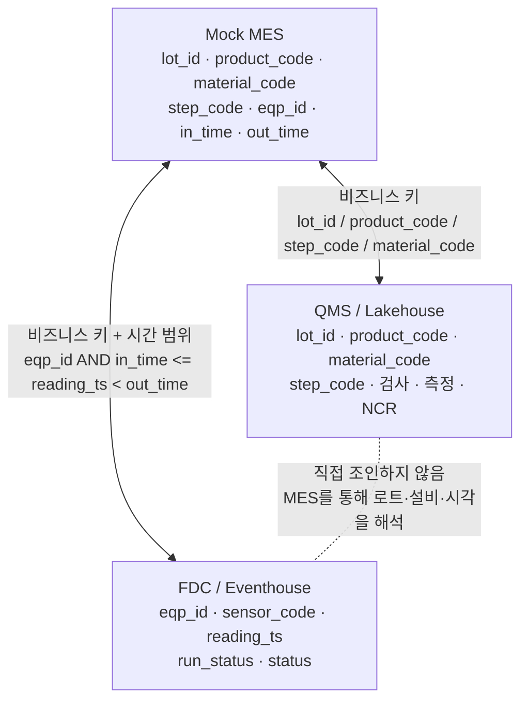
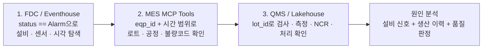

# 데이터 관계와 교차 분석 흐름

이 문서는 [사내 제조 시스템 개요](README.md)에서 소개한 Mock MES, QMS, FDC가
어떤 데이터로 이어지는지 설명합니다. 이 관계를 이해하면 복합 질문에 왜 여러
원본의 근거가 필요한지 알 수 있습니다. 아래 교차 분석은 업무상의 연결 원리이며,
현재 Foundry IQ의 한 질문이 이 전체 흐름을 자동 실행한다는 뜻은 아닙니다.

## 시스템별 원장

| 시스템 | 원장으로 관리하는 사실 | 대표 데이터 |
| --- | --- | --- |
| Mock MES | 생산 흐름과 공정 실행 | 로트, 제품, 자재, 공정실적, 설비, WIP |
| QMS | 품질 판정과 후속 조치 | 검사 기준, 검사, 측정값, 입고검사, 부적합, 처리 결정 |
| FDC | 설비의 시계열 상태 | 센서 판독값, `run_status`, `status` 경보 상태, 센서 규격 |

각 시스템은 독립적인 업무 목적을 갖습니다. 세 시스템 사이에는 데이터베이스
외래 키가 없으므로, 에이전트와 분석자는 아래의 비즈니스 키를 사용해 결과를
연결합니다.

현재 Fabric 실습은 `factory_lakehouse`의 `mes` 3개·`qms` 8개 테이블과
별도 `fdc_eventhouse`를 사용합니다. `mes.process_result`에는 실행 ID·로트·설비·공정·
시작/종료 시각만, `mes.equipment`에는 설비 ID·유형만, `mes.lot`에는 로트 ID·제품 코드만
복제합니다. 생산 판정·수량·작업자·현재 WIP·제품/자재/BOM 원장 전체가 Fabric에
복제된다고 가정하지 않습니다. 필요한 정보가 없으면 원본 MES의 지원 도구를 확인합니다.

### 같은 사건을 세 시스템에 나누어 묻는 이유

"CMP 압력 경보가 품질 문제를 일으켰는가?"는 하나의 질문처럼 보이지만, 실제로는
서로 다른 업무 질문 네 개입니다.

| 업무 질문 | 답해야 하는 시스템 | 근거 | 의사결정에 쓰는 방식 |
| --- | --- | --- | --- |
| 경보는 실제로 언제, 어느 센서에서 발생했는가? | FDC | `eqp_id`, `sensor_code`, `reading_ts`, `status` | 설비 점검과 이상 구간 확정 |
| 그때 어떤 로트가 설비에서 처리됐는가? | MES | `eqp_id`, `in_time`, `out_time`, `lot_id`, `step_code` | 영향 로트와 공정 범위 확정 |
| 그 로트가 검사 규격을 벗어났는가? | QMS | 검사 기준, 실측값, 검사 판정 | 품질 영향 확인 |
| 영향 로트를 어떻게 처리할 것인가? | QMS + MES | NCR, 처리 결정, 현재 WIP와 생산 상태 | Hold, 재검사, 재작업, 폐기 또는 생산 재개 결정 |

FDC의 경보만으로 불량을 단정하거나, QMS의 불합격만으로 설비 원인을 단정하지
않습니다. MES가 두 시스템의 같은 생산 사건을 연결하는 기준점을 제공합니다.

## 데이터 연결 키와 시간축

### MES와 QMS

QMS는 생산 결과를 중복 보관하지 않습니다. 예를 들어 QMS에는 MES의
`mes_result`, `scrap_qty`, `operator`, `in_qty`, `out_qty`가 없습니다. 특정
로트의 생산 이력은 MES에서 확인하고, 그 로트의 검사·측정·부적합은 QMS에서
확인합니다.

QMS와 MES를 연결할 때는 질문에 맞는 키를 사용합니다.

| 확인하려는 내용 | 연결 키 |
| --- | --- |
| 검사가 발견한 실제 생산 실행 | `qms.inspection.mes_process_result_id` → `mes.process_result.id` |
| 특정 로트의 검사 및 부적합 | `lot_id` |
| 제품과 공정별 검사 기준 | `product_code` + `step_code` |
| 자재 입고검사 | `material_code` |

같은 로트에는 여러 공정실적이 있으므로 `lot_id`만으로 특정 검사와 생산 설비를
확정하지 않습니다. 검사에 연결된 생산 실행 ID를 우선 대조합니다. NCR은 여러
참조를 함께 가질 수 있어 조회 경로별 중복을 제거해야 하며, 같은 생산 실행의
재검사라고 해서 특정 기본 검사의 직접 후속 검사로 연결된 것은 아닙니다.

### MES와 FDC

FDC의 `fdc_sensor_reading`에는 `lot_id`, `product_code`, 불량코드, 검사 판정이
없습니다. 센서는 설비가 가동 중인지(`run_status`)와 센서값이 정상·경고·경보인지
(`status`)만 압니다.

따라서 FDC에서 경보를 찾은 뒤에는 `eqp_id`와 `reading_ts`를 MES의
`eqp_id`, `in_time`, `out_time`과 범위로 비교해야 합니다. 같은 설비에서 같은 시각에
실행 중이던 공정실적이 그 센서값의 대상 로트를 알려 줍니다.

현재 생성 코드의 가동 구간은 **`in_time <= reading_ts < out_time`**입니다.
종료 시각을 포함하면 다음 공정 구간의 관측을 중복 연결할 수 있습니다. 로트·설비가
같다는 이유만으로 기간 밖의 경보를 해당 검사나 생산의 원인으로 해석하지 않습니다.

## 시간축을 맞춰야 하는 이유

QMS 데이터와 FDC 데이터는 모두 MES 공정실적을 기준으로 생성됩니다. QMS 날짜는
조회한 MES의 최대 `out_time`을 UTC 기준 앵커로 사용합니다. 두 노트북은 MES를
각각 조회하므로, 연달아 실행해도 원본을 잠근 단일 스냅샷이나 같은 시간축이
자동으로 보장되는 것은 아닙니다.

MES 원본 이력이 바뀌지 않았는지, 생산 실행 ID·설비·시작/종료 시각과 실제 적재 범위가
일치하는지 대조합니다. FDC는 가동 30초·유휴 5분 간격의 표본이며 생산 종료 뒤에도
유휴 데이터가 이어질 수 있으므로 최신 센서 시각만으로 같은 생산 구간이라고 판단하지 않습니다.

시간축이 어긋났다면 [현재 Fabric 적재 안내](../02-fabric-iq/helper-new/README.md)의
초기 적재·워터마크·재실행 제약을 먼저 확인합니다. 단순 재실행이 과거 FDC 구간을
다시 생성한다고 가정하지 않으며, 공유 MES를 재시드하거나 다른 참가자의 데이터를
수정하지 않습니다.

## FDC에서 시작하는 3단 교차 분석

설비 이상을 조사하는 대표 흐름은 다음과 같습니다.

1. FDC Eventhouse에서 `status == "Alarm"`인 판독값을 찾아 이상 설비, 센서,
   발생 시각을 확인합니다.
2. MES의 읽기 전용 도구로 공정실적을 조회하고, 반환된 설비 ID와 생산 시간
   구간을 대조해 당시 처리한 로트·공정 단계·생산 결과를 확인합니다. 실제
   도구가 제공하는 매개변수만 사용하며 설비·시간 필터가 있다고 가정하지 않습니다.
3. QMS Lakehouse에서 해당 `lot_id`의 검사 결과, 측정값, 부적합 보고서(NCR),
   처리 결정을 확인합니다.

이 순서는 FDC가 현상을, MES가 생산 맥락을, QMS가 품질 영향을 제공한다는 역할
분담을 따릅니다. 현재 [05 Foundry IQ](../05-foundry-iq/README.md)는 MES가 연결된
공정 KB와 Fabric Data Agent가 연결된 품질 KB를 별도로 사용합니다. 위의
FDC → MES → QMS 전체 조사 흐름을 한 질문으로 자동화하거나 두 KB의 답변을
자동 병합하는 구성은 아닙니다. 실제로 수행한 조회와 아직 필요한 조회를 구분하세요.

## 확인할 수 있는 질문

- 어느 설비의 어떤 센서가 언제 경보를 냈는가?
- 그 시각에 설비에서 처리하던 로트와 공정은 무엇이었는가?
- 그 로트는 검사에서 어떤 규격 이탈 또는 부적합 판정을 받았는가?
- 부적합은 어떤 처리 결정으로 이어졌는가?

이 질문들은 한 시스템의 단독 답변이 아니라, 세 시스템의 경계를 지키면서
연결한 답변이어야 합니다.