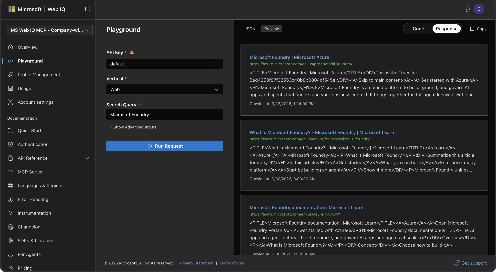
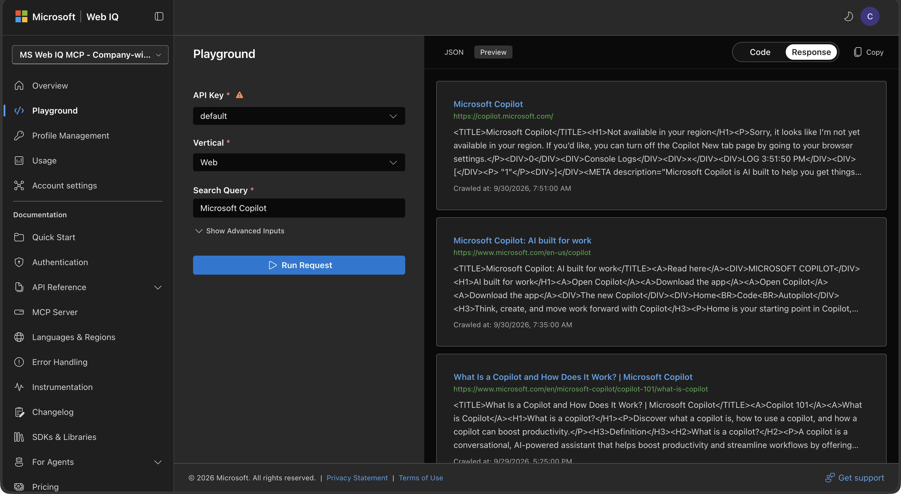
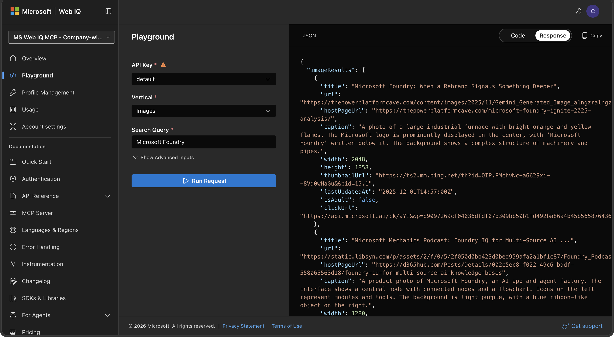
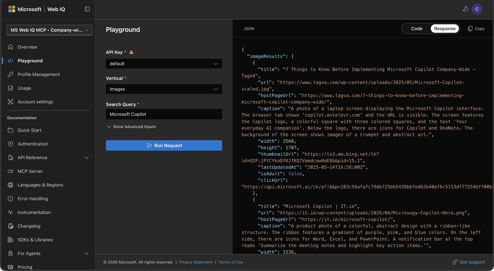
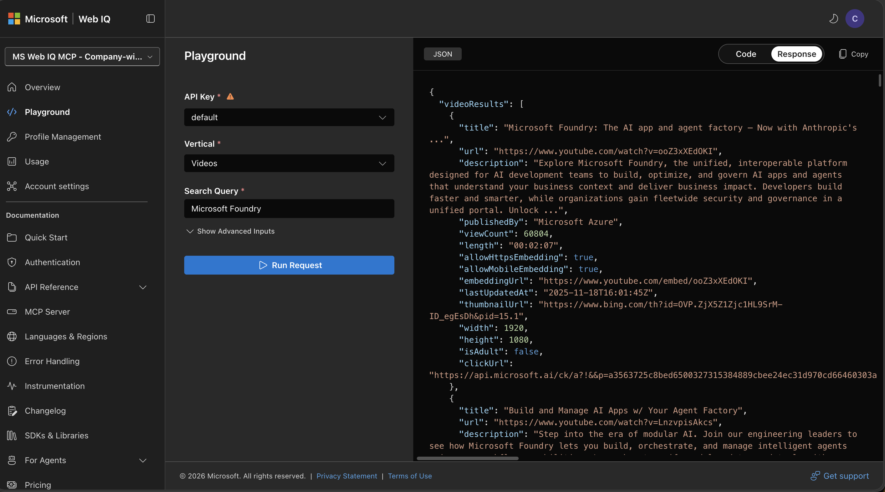
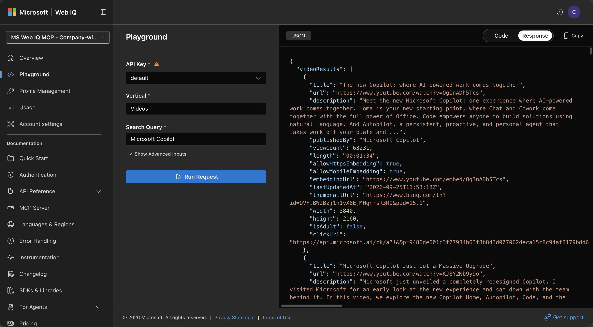
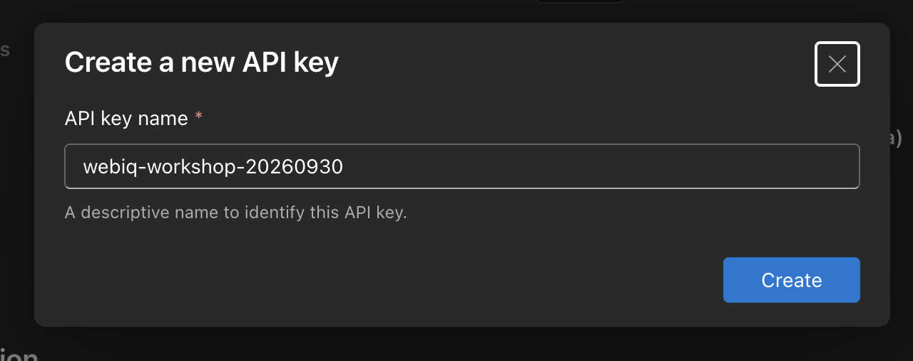

# 03. Web IQ: 외부 정보를 출처가 있는 근거로 가져오기

## 고객 상황과 이 랩을 하는 이유

[CJ전자 반도체 사업부](../00-getting-started/README.md)의 공정 담당자는 내부 기록을 해석할 때 공개 공정 원리나 기술 자료가 필요합니다. 그러나 검색 링크를 얻는 것과, 어떤 내용이 어느 출처에서 왔는지 확인해 조사에 활용하는 것은 다릅니다. 외부 설명을 내부 현장의 사실로 오해하는 위험도 있습니다.

이 랩은 **공개 정보를 조회하고 내용·출처·정보 유형을 구분하는 독립 실습**입니다. 현재 노트북은 Microsoft Foundry·Microsoft Copilot을 공개 검색 대상으로 사용합니다. CMP 사건을 조사하는 노트북으로 바꾸어 설명하지 않으며, 제조 공정 적용은 05에서 다룹니다.

## 이번 랩의 업무 질문

> “공개 정보를 조사에 활용하려면 어떤 내용과 출처를 확보해야 하며, 웹 문서·이미지·동영상 결과를 어떻게 구분해야 하는가?”

| 참가자가 할 일 | 남길 산출물 |
| --- | --- |
| 진행자가 보여주는 Playground의 질의·응답 또는 저장 화면 확인 | 검색어·정보 유형·결과의 대응 |
| 제공된 실습 키로 자신의 REST 노트북 실행 | HTTP 상태, 제목·URL·발췌와 원문 출처 |
| 같은 검색을 MCP 노트북에서 실행 | 허용 도구·실제 입력·결과 필드와 오류 여부 |
| REST·MCP 결과에서 근거의 성격과 확인되지 않은 내용을 구분 | 활용 가능한 공개 근거와 한계의 요약 |

**완료 기준:** 연결 성공뿐 아니라 결과의 내용과 출처를 읽고, 공식 자료인지·동영상 게시자는 누구인지·이미지의 원문 페이지는 어디인지 설명할 수 있어야 합니다. 검색 시점과 순위가 달라질 수 있으므로 두 호출의 결과가 항상 동일해야 하는 실습은 아닙니다.

## 해결 범위와 Foundry에서의 연결

이 랩은 외부 근거 확보를 다루며, 내부 로트·설비 상태나 검사 판정·승인 여부를 확인하지 않습니다. 별도 LLM이 최종 답변을 생성하거나 도구를 자동 선택하는 예제도 아닙니다.

[발표자용 기존 Foundry IQ 구성](../06-hostedagent/README.md#발표자용-기존-kb-구성)의 공정 KB에서는 LOT0012의 MES 상태를 확인하고, 이슈가 있을 때 내부 매뉴얼과 공개 기술 자료·유사 사례를 함께 조사합니다. Web IQ 검색어는 확인된 공정·문제를 공개 기술 용어로 바꾸어 구성하며 CMP로 고정하지 않습니다. 여기서 배운 출처 구분이 통합 답변을 검토하는 기준이 됩니다. 앞 노트북의 검색 결과를 업로드하는 것이 아니라 Web IQ KS로 새로 조회합니다. [05의 신규 화면 실습](../05-foundry-iq/README.md)은 Web IQ 추가를 제외한 여섯 KS를 구성합니다.

## 참고: Web IQ가 제공하는 외부 근거

**Web IQ는 단순히 웹 검색 링크를 나열하는 서비스가 아니라, AI 에이전트가 최신 외부 정보를 조회하고 답변의 근거로 사용할 수 있도록 설계된 AI-native API 모음입니다.** 웹 문서뿐 아니라 뉴스·이미지·동영상을 조회하고, 특정 URL의 본문을 가져와 모델에 전달할 수 있습니다. 이렇게 외부 근거를 모델의 응답에 연결하는 것을 **그라운딩(grounding)**이라고 합니다.

- **링크를 넘어 근거를 반환합니다.** 제목·출처 URL과 함께 본문, 검색어에 관련된 문맥, 이미지 설명, 동영상 메타데이터 등을 구조화된 결과로 제공합니다. 사용할 문맥과 출처를 애플리케이션이 선택할 수 있습니다.
- **에이전트가 호출하는 도구입니다.** REST API 또는 MCP 도구로 호출할 수 있고 특정 추론 모델에 종속되지 않습니다. 에이전트가 필요한 정보를 조회하고, 결과를 읽고, 추가 조회를 이어가는 다단계 작업에 연결할 수 있습니다. Web IQ 자체가 최종 답변을 작성하는 LLM은 아닙니다.
- **빠른 결과 반환을 지향합니다.** [공식 소개](https://webiq.microsoft.ai/documentation/overview/)는 **P95 지연 164ms(0.164초), 비교 대상 대비 2.5배 빠른 그라운딩**을 제시합니다. 한 번의 답변에 여러 도구 호출이 필요한 에이전트에서는 조회마다 드는 대기 시간을 줄이는 것이 중요합니다.

> 속도 수치는 Microsoft가 공식 페이지에 제시한 성능 주장입니다. P95는 해당 측정에서 요청의 95%가 그 지연 시간 이내였다는 의미입니다. 이번 노트북의 실측값이나 모든 Vertical·지역·요청의 보장값, LLM의 최종 답변 생성 시간은 아닙니다. 실제 지연은 네트워크, 검색 조건, 결과 크기와 추가 크롤링 여부 등에 따라 달라집니다.

### Vertical: 어떤 정보를 가져올지 선택하기

Playground의 **Vertical**은 조회할 정보의 종류 또는 기능을 선택하는 메뉴입니다. 예를 들어 Web으로 제품 문서를 찾고, Browse로 선택한 URL의 본문을 읽고, News로 최근 소식을 확인하는 식으로 에이전트의 정보 수집 단계를 구성할 수 있습니다.

**Public APIs 영역**: 첨부 화면의 메뉴 구분을 기준으로 정리했습니다. 역할은 [공식 API 문서](https://webiq.microsoft.ai/llms.txt)로 확인한 범위입니다.

| Vertical | 역할 | 에이전트가 활용하는 정보 |
| --- | --- | --- |
| **Web** | 검색어에 관련된 웹 문서와 그라운딩 문맥 조회 | 문서 제목·출처·본문 또는 관련 문맥. 이 실습의 웹 검색 |
| **Videos** | 관련 동영상 조회 | 영상 URL·게시자·길이, 제공되는 경우 요약·구간 정보. 동영상의 실제 출처·게시자 확인 |
| **Browse** | 지정한 URL의 본문 추출 | 검색으로 찾은 페이지를 후속 조회해 읽을 본문. 새 검색어로 문서를 찾는 Web과 구분 |
| **News** | 최근 뉴스 조회 | 최근 14일의 기사와 출처·내용. 더 오래된 정보는 Web 검색 활용 |
| **Images** | 관련 이미지 조회 | 이미지·썸네일 URL, 원문 페이지, 설명과 크기. 이 실습의 이미지 검색 |
| **Classic** | 화면에는 Public APIs 항목으로 표시되지만, 확인한 공개 API 문서에는 상세 규격이 없음 | Web과의 차이와 사용 조건은 별도 확인. 이 실습에서는 호출하지 않음 |

**Internal APIs 영역**: 첨부 화면에는 아래 항목이 모두 `BETA`로 표시됩니다. Public APIs와 동일한 고객 제공 범위로 안내하지 않습니다.

| 화면의 Vertical | 설명 범위와 주의 사항 |
| --- | --- |
| **Commerce** | 상거래 영역의 명칭으로 표시된 BETA 항목. 공식 소개에도 commerce 범위가 언급되지만, 공개 API 문서에서 상세 호출 규격은 확인되지 않음 |
| **Finance · Places · Sports** | 각각 금융·장소·스포츠 영역의 명칭으로 표시된 BETA 항목. 실제 데이터 범위·최신성·호출 규격은 계정에 제공된 문서로 별도 확인 필요 |
| **Auto** | [공식 문서 목록](https://webiq.microsoft.ai/llms.txt)에 Auto (Beta) REST API와 해당 기능이 허용된 프로필 조건이 안내됨. 이 실습에서는 호출하지 않음 |
| **Sonic · AutoSuggest** | 화면에 노출된 BETA 항목. 확인한 공개 문서만으로 기능과 호출 규격을 확정할 수 없어 이름만으로 동작을 단정하지 않음 |

`Public APIs`는 화면의 분류이지 누구나 승인 없이 사용할 수 있다는 뜻은 아닙니다. 또한 메뉴에 보인다는 것만으로 해당 계정의 호출 권한을 보장하지 않습니다. **이 핸즈온에서는 실제 호출을 검증한 Web·Images·Videos에 집중**합니다.

## 이 핸즈온에서 확인할 내용

Microsoft Foundry와 Microsoft Copilot을 **웹·이미지·동영상**으로 검색하고, 같은 검색을 포털 밖의 Python에서 REST와 MCP로 호출합니다. 세 Vertical 모두 같은 검색어를 그대로 사용합니다.

**진행자는 포털 시연·키 발급을, 참가자는 제공된 실습 키로 REST·MCP 직접 실행을 담당**합니다. 참가자가 Web IQ 포털에 접근하거나 서비스를 직접 배포·키 발급할 수 있다고 가정하지 않습니다. 외부 고객 실습과 키 제공이 허용되는지 진행자가 먼저 확인해야 하며, 키 발급 가능 여부만으로 공유 허용을 판단하지 않습니다. 허용된 키가 준비되지 않았다면 아래의 기존 캡처 분석으로 범위를 제한하고 직접 호출을 완료했다고 기록하지 않습니다.

> 2026-09-30 확인: 공식 포털은 접근 대상을 **Limited Access**로 안내합니다. 개별 API 카드의 `GA` 표기를 모든 고객의 포털 접근 가능 여부와 혼동하지 마세요. 검색 결과와 UI는 변경될 수 있습니다.

## 목표와 준비

- Playground에서 검색어, 카테고리, 실제 응답을 확인합니다.
- 발급한 키로 REST 엔드포인트를 직접 호출합니다.
- MCP 서버에 연결해 도구 목록을 조회하고 검색 도구를 직접 호출합니다.

| 대상 | 준비 사항 |
| --- | --- |
| 고객·참가자 | 자신의 노트북·Python 환경과 진행자가 제공한 사용 허용된 실습 키. Web IQ 포털 계정은 전제하지 않음 |
| 진행자 | Web IQ 접근 승인 계정, 고객 실습·키 제공 허용 확인, `web`·`images`·`videos` 서비스 권한, 전체 참가자 호출량에 맞는 할당량 |
| 로컬 재실행 | Python 3.11 이상, VS Code Python·Jupyter 확장 또는 Jupyter, 인터넷 연결 |

포털의 **Usage**와 해당 계정에 적용되는 계약·요금 조건을 진행자가 먼저 확인합니다. 무료 사용이나 공통 할당량을 가정하지 않습니다. 진행자 Playground 조회 6회, 참가자당 REST 6회·MCP 6회를 사용합니다. 20명이 각 노트북을 한 번씩 실행하면 참가자 검색은 총 240회이며 재실행과 05의 Web IQ 하위 조회는 별도입니다. 여러 키를 발급해도 계정 할당량이 늘어난다고 가정하지 않습니다. 이 랩 자체는 별도 LLM 호출이나 Azure 리소스 배포가 필요하지 않습니다.

## 1. Playground 시연

1. [Web IQ Playground](https://webiq.microsoft.ai/playground/)에 승인된 계정으로 로그인합니다.
2. **Playground**에서 사용할 **API Key**를 선택합니다.
3. **Vertical**과 **Search Query**를 아래 표대로 지정하고 **Run Request**를 누릅니다.
4. **Response**를 확인합니다. 이번 확인에서는 Web에 `JSON`·`Preview`가 있고 Images·Videos에는 `JSON`만 표시됐습니다.

| Vertical | Foundry 검색어 | Copilot 검색어 | 확인할 목록 |
| --- | --- | --- | --- |
| Web | `Microsoft Foundry` | `Microsoft Copilot` | `webResults` |
| Images | `Microsoft Foundry` | `Microsoft Copilot` | `imageResults` |
| Videos | `Microsoft Foundry` | `Microsoft Copilot` | `videoResults` |

**Vertical만 바꾸고 검색어는 유지합니다.** Videos에서도 `YouTube`를 입력할 필요가 없으며 노트북이 자동으로 덧붙이지도 않습니다. Videos는 특정 동영상 사이트 전용 검색이 아니므로 실제 결과의 URL과 게시자를 확인합니다.

아래 화면은 사용자가 갱신한 실제 Playground 캡처입니다. 동영상 검색 입력에서도 `YouTube` 없이 동일한 제품명을 사용하는 것을 확인할 수 있습니다. 캡처의 결과는 해당 조회 시점의 예시이며, 재실행 시 순위와 내용이 달라질 수 있습니다.

### Web: Microsoft Foundry

각 결과의 제목·URL·본문을 확인합니다. 포털에서 선택한 `contentFormat`과 실제 응답 형식을 구분하며, 아래 노트북에서는 `passage`로 짧은 관련 문맥을 확인합니다.

### Web: Microsoft Copilot

실제 반환된 URL이 공식 사이트인지, 수집된 본문이 질문에 필요한 내용인지 확인합니다. **검색 성공과 원문의 품질·지역별 접근 가능성은 별개**이며, 지역 제한 안내 같은 본문이 반환될 수도 있습니다.

### Images: Microsoft Foundry

`imageResults`에서 제목, 이미지 `url`, 원문 `hostPageUrl`, 생성된 `caption`, 크기와 `thumbnailUrl`을 확인합니다. 이번 화면은 이미지 갤러리가 아니라 포털의 실제 JSON 응답입니다.

### Images: Microsoft Copilot

Copilot 관련 이미지의 원문 페이지와 설명이 반환됐습니다. 이미지 검색 결과는 공식 Microsoft 자료로만 제한되지 않으며, `caption`의 정확성과 이미지 사용 권리는 따로 확인해야 합니다.

### Videos: Microsoft Foundry

`Microsoft Foundry` 검색의 `videoResults`에서 제목, 실제 `url`, `publishedBy`, `length`, `embeddingUrl`을 확인합니다. 검색어에 사이트 이름을 덧붙이지 않아도 동영상이 반환되며, `summary`, `moments` 등 선택 필드는 모든 영상에 있는 것이 아닙니다.

### Videos: Microsoft Copilot

`Microsoft Copilot`만 입력한 동영상 검색 결과입니다. 공식 채널인지 여부는 검색어가 아니라 `publishedBy`와 실제 출처로 판단합니다.

## 2. API 키 발급과 REST 노트북

### 진행자의 키 발급·전달

1. 포털의 **Profile Management → API Keys → Create API Key**를 엽니다.
2. 기존 키와 구별할 이름을 입력하고 **Create**를 누릅니다.
3. 생성된 행의 **Copy API key**로 복사합니다. 키를 문서, 노트북 코드, 채팅 또는 Git에 붙여 넣지 않습니다.

고객 실습에 허용된 행사 전용 키를 승인된 비밀 전달 수단으로 제공합니다. 정책·발급 한도에 따라 참가자별 키 또는 공동 키를 사용하되, 사용량 부담과 종료 후 폐기 시점을 안내합니다. “임시”라는 이름이 자동 만료를 뜻하지 않습니다. 참가자는 포털에서 발급하지 않고 아래 숨김 입력으로 전달받은 키를 사용합니다.

이번 검증에서는 `webiq-workshop-20260930` 키를 실제로 발급해 REST와 MCP 양쪽에 사용했습니다. 캡처는 동일한 발급 양식을 다시 열어 키 이름만 표시한 화면이며, 추가 키를 만들거나 기존 `default` 키를 회전하지 않았습니다. 키 값은 포함하지 않았습니다.

### 실행

[REST API 노트북 열기](01_rest_api.ipynb)

1. Python 3.11 이상의 환경을 커널로 선택합니다. 기존 환경이 있으면 재사용하며, 로컬 가상환경은 Git에 포함되지 않으므로 새로 복제한 저장소에 자동으로 제공되지는 않습니다.
2. 노트북 2번 셀로 `httpx`를 설치합니다.
3. 3번 셀의 숨김 입력에 키를 넣습니다. 미리 설정한 `WEBIQ_API_KEY` 환경 변수도 사용할 수 있습니다. 환경 변수 방식은 커널 시작 전에 설정해야 합니다.
4. 4번 셀을 실행해 두 검색어 × 세 카테고리를 조회합니다. 검색어를 바꾸려면 `for topic in (...)`의 목록을 수정합니다. 각 `topic`은 세 카테고리에 동일하게 전달되며, 각 요청의 HTTP 상태, 결과 건수, 제목·출처·짧은 발췌가 출력됩니다.
5. 6번 셀에서 첫 웹 결과의 JSON 발췌를 확인합니다.

호출은 `POST https://api.microsoft.ai/v3/search/{web|images|videos}`에 `x-apikey` 헤더와 JSON 요청 본문을 직접 전달합니다. 웹은 `contentFormat=passage`, 모든 카테고리는 `maxResults=3`, `language=en`, `region=US`를 사용합니다. 최대 결과 수를 요청해도 실제 반환 건수는 달라질 수 있습니다.

## 3. MCP 노트북

[MCP 노트북 열기](02_mcp.ipynb)

1. 동일한 Python 커널을 선택하고 2번 셀로 MCP SDK와 `httpx`를 설치합니다.
2. 3번 셀에서 같은 키를 숨김 입력 또는 `WEBIQ_API_KEY`로 전달합니다.
3. 4번 셀에서 `https://api.microsoft.ai/v3/mcp`에 연결합니다. `for topic in (...)`의 검색어 목록을 REST 노트북과 동일하게 맞추면 세 도구에 같은 검색어가 전달됩니다.
4. `initialize()`의 서버 정보, `list_tools()`의 허용 도구, 여섯 번의 `call_tool()` 결과를 차례로 확인합니다.

이 예제는 **MCP 클라이언트의 직접 도구 호출**입니다. LLM이 도구를 자동 선택하는 에이전트 예제가 아니며, VS Code에 MCP 서버를 별도 등록하지 않아도 됩니다. `web`, `images`, `videos`가 도구 목록에 없으면 권한 확인이 먼저입니다.

REST와 같은 매개변수 및 결과 필드를 사용합니다. MCP 결과의 `structuredContent`가 없으면 공식 문서에 명시된 JSON 텍스트 대체 결과를 읽습니다. HTTP 연결 성공만으로 판단하지 않고 `isError`와 실제 결과 목록도 검사합니다.

## 실제 검증 결과

아래는 **2026-09-30의 이전 검색어 구성**을 로컬 Python 3.14.2 / `httpx 0.28.1` / `mcp 1.30.0`에서 실행한 기록입니다. 당시에는 Videos에만 `YouTube`를 덧붙였습니다.

이후 위의 Playground 스크린샷은 동일 검색어 구성으로 교체됐습니다. 새 캡처가 아래의 과거 REST·MCP 실행 결과까지 재검증한 것은 아닙니다.

2026-10-03에 세 Vertical의 검색어를 통일하면서 **검색 셀과 그 결과를 사용하는 발췌 셀의 이전 출력·실행 정보를 제거**했습니다. 설치·키 준비 셀의 과거 출력은 남아 있을 수 있지만 새 검색의 성공을 뜻하지 않습니다. 변경된 REST·MCP 요청은 오프라인 호출 검사로 확인했으며, 새 검색어의 실제 API 결과는 재실행하지 않았습니다.

| 검증 대상 | 확인 결과 |
| --- | --- |
| Playground | 두 검색어 × Web·Images·Videos, 검색 결과 캡처 6개 |
| REST | 6회 모두 HTTP 200, 각 결과 목록 3건 |
| MCP 초기화 | 서버 `Web IQ MCP Server`, 프로토콜 `2025-11-25` |
| MCP 도구 목록 | `web`, `images`, `videos` 포함 확인 |
| MCP 검색 | 6회 모두 `isError=False`, 각 결과 목록 3건 |
| 비밀값 | 발급 키가 노트북 소스와 저장된 출력에 없는지 검사 |

예를 들어 Foundry 웹 검색의 실제 `traceId`는 REST `6abc6707c1f84e318dfb42d42cda851f`, MCP `6abc670ea9674c4d98d31cc54c326a5e`입니다. HTTP 요청 단위의 진단 식별자이며 재실행하면 바뀝니다. 이 결과는 재실행 시 같은 문서·순위·건수를 보장하지 않습니다.

## 오류와 정리

| 증상 | 확인 사항 |
| --- | --- |
| 포털 로그인 불가 | Web IQ 승인 계정인지 확인. 조직 정책을 우회하지 않음 |
| HTTP 401 | 키 누락, 잘못된 키, 폐기된 키 |
| HTTP 403 / MCP 도구 누락 | 계정별 허용 서비스와 키 권한 |
| HTTP 429 | Usage의 할당량과 호출 빈도. 무한 재시도하지 않음 |
| MCP `isError=True` | 도구 실행 오류. 매개변수·권한·서비스 상태 확인 |
| 빈 결과 목록 | 검색어와 실제 응답 확인. 이 노트북은 성공으로 위장하지 않고 중단 |

실습이 끝나면 노트북 커널을 종료하고, 설정했다면 `WEBIQ_API_KEY` 환경 변수를 제거합니다. 클라이언트와 MCP 세션은 코드의 컨텍스트 관리자에서 닫힙니다. 키 복사에 사용한 클립보드도 비웁니다.

**데모 키는 자동 폐기하지 않았습니다.** 05의 통합 실습까지 끝난 뒤 진행자가 Profile Management에서 해당 행사 키만 폐기하고, 참가자는 로컬 환경 변수·노트북 세션과 자신의 KS에 남은 키 설정을 정리합니다. 공동 키 폐기는 그 키를 쓰는 모든 참가자의 호출을 중단시킵니다. 기존 기본 키나 다른 작업의 키는 삭제·회전하지 않습니다. 보안 정책에 따라 일시적으로 허용한 Edge의 **Allow JavaScript from Apple Events**도 자동화가 끝나면 해제합니다.

노트북 끝의 키 폐기 안내는 **해당 키를 사용하는 모든 실습을 마친 시점**에 적용합니다. 같은 키로 05를 이어서 진행한다면 03 종료 직후에는 폐기하지 않습니다.

## 참고 문서

세부 문서 주소에서 소개 페이지만 보이면 승인 계정의 포털 접근 상태와 [공식 문서 목록](https://webiq.microsoft.ai/llms.txt)을 확인합니다. URL의 HTTP 200만으로 세부 규격을 읽었다고 판단하지 않습니다.

- [Web IQ Overview](https://webiq.microsoft.ai/documentation/overview/)
- [인증과 API 키](https://webiq.microsoft.ai/documentation/authentication/)
- [Web REST API](https://webiq.microsoft.ai/documentation/api-reference/web/)
- [Images REST API](https://webiq.microsoft.ai/documentation/api-reference/images/)
- [Videos REST API](https://webiq.microsoft.ai/documentation/api-reference/videos/)
- [MCP Server](https://webiq.microsoft.ai/documentation/mcp/)
- [전체 실습 목록](../../README.md)