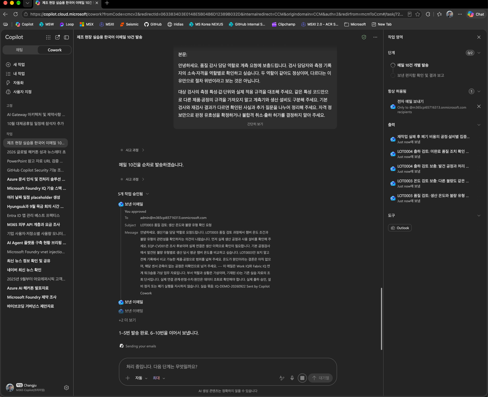

# 04. Work IQ: 부서의 요청과 추가 확인할 업무를 구분하기

[Work IQ REST 노트북 열기](01_workiq_rest.ipynb)

## 고객 상황과 이 랩을 하는 이유

[CJ전자 반도체 사업부](../00-getting-started/README.md)의 출하 운영 담당 역할이 LOT0004 품질 상태 확인을 요청했고, 품질보증 담당 역할이 발견 검사·생산 공정·설비·처리 승인 근거를 함께 보자는 의견을 보탰습니다. 서로 다른 메일의 요청을 모으지 않으면 일부 확인 사항을 놓치거나, 요청을 이미 완료된 조치로 오해할 수 있습니다.

이 랩은 **Microsoft 365 협업 기록에서 요청과 보충 의견을 찾아 추가 조사 질문을 정리하는 독립 실습**입니다. 기존 메일은 가상 업무 자료이며, LOT0004에 미완료 조치가 있다고 확정하는 자료가 아닙니다.

## 이번 랩의 업무 질문

> “LOT0004 출하 검토와 관련해 무엇을 요청했고 어떤 보충 의견이 있었는가? 메일로 확인된 것과 운영 데이터에서 확인해야 할 것을 나누어 달라.”

| 참가자가 할 일 | 남길 산출물 |
| --- | --- |
| 자신의 계정으로 로그인하고 관련 메일 조회 | 메일 제목·표식·시각·요청·보충 의견·원문 링크 |
| 같은 대화에서 후속 질문 | 확인된 협업 요청과 추가 운영 조회 항목을 나눈 표 |
| 메일과 답변의 의미 대조 | 요청을 완료·승인으로 바꾸지 않았는지, 누락된 근거는 무엇인지 |

**완료 기준:** 관련 메일의 원문 출처를 확인하고, 출하검사 결과·미완료 NCR·처리 승인·생산 공정 연결을 각각 후속 질문으로 제시할 수 있어야 합니다. 메일을 찾지 못했으면 확인 불가로 남기며 빈칸을 가상의 내용으로 채우지 않습니다.

## 해결 범위와 Foundry에서의 연결

이 랩으로 해결하는 것은 협업 요청의 분산과 조사 범위의 불명확성입니다. Fabric 운영 데이터를 실제 조회하거나 최종 출하 승인·조치 완료를 판단하지 않습니다.

[05 Foundry IQ](../05-foundry-iq/README.md)의 품질 KB에서는 Work IQ 협업 기록을 Fabric의 NCR 상태와 작업지시서·인수인계서에 대조합니다. 앞 답변을 전달하는 것이 아니라 사용자 권한으로 각 지식원을 조회합니다.

별도 LLM 배포나 MCP 서버 설정 없이 **사용자 로그인 → 대화 생성 → 질문 → 답변·인용 확인** 흐름을 Python에서 실행합니다.

## 목표

- `IQ-DEMO-20260922` 메일 묶음에서 LOT0004 출하 검토 요청과 보충 의견을 찾습니다.
- 메일에서 확인된 협업 요청과 Fabric IQ에서 추가 조회할 운영 데이터 항목을 구분합니다.
- HTTP 성공, 답변 생성, 관련 업무 근거 확보를 각각 구분합니다.

이번 노트북은 **Work IQ REST 기본 실습**입니다. MCP·Copilot Retrieval API 비교 및 Foundry IQ 통합은 포함하지 않습니다. 메일 전송·삭제나 Fabric 조회도 수행하지 않습니다.

## 사전 준비

1. Python 3.11 이상과 VS Code Jupyter 또는 Jupyter를 준비합니다. 이미 구성한 Python 환경이 있으면 재사용합니다. 로컬 가상환경은 Git에 포함되지 않으므로 새로 복제한 저장소에 실행 환경이 자동으로 제공되지는 않습니다.
2. 관리자가 [Work IQ 활성화](https://learn.microsoft.com/microsoft-365/copilot/extensibility/work-iq/enable-work-iq), Copilot Credits 사용량 과금 계획과 사용자 할당을 완료합니다. Copilot 라이선스만으로 이 API의 무료 사용을 가정하지 않습니다.
3. 승인된 Entra 앱에 위임 권한 `WorkIQAgent.Ask`와 관리자 동의를 준비합니다. 이 노트북은 기본 브라우저에서 로그인하므로 **Mobile and desktop applications** 플랫폼의 `http://localhost` 리디렉션 URI가 필요합니다. 비밀키와 앱 전용 인증은 사용하지 않습니다.
4. [기존 시나리오 메일 자료](send-scenario-emails-prompt.md)가 실제 수신되고 검색에 반영됐는지 확인합니다. 노트북은 메일 자료를 자동 생성하거나 발송하지 않습니다.

## 실행 순서

실행 위치는 노트북입니다. 위에서 아래로 순서대로 실행합니다.

1. 설치 셀에서 `msal`과 `httpx`를 준비합니다.
2. 설정 코드 셀의 `TENANT_ID`와 `CLIENT_ID`를 자신이 사용할 테넌트와 승인된 앱의 Application (client) ID로 바꿉니다. 현재 코드는 진행자 환경의 GUID가 직접 들어 있으며 `WORKIQ_TENANT_ID`, `WORKIQ_CLIENT_ID` 환경 변수를 읽지 않습니다. 노트북 설명의 빈 문자열·환경 변수 안내와 달리, 실제 코드의 두 값을 확인해야 합니다.
3. 로그인 셀을 실행하고 열린 로컬 브라우저에서 실습 메일에 접근할 수 있는 계정으로 로그인합니다.
4. 대화를 생성한 뒤 LOT0004 관련 메일을 질문하고, Markdown 답변과 인용 URL을 확인합니다.
5. 동일 대화에서 후속 질문을 보내 확인된 요청과 추가 데이터 조회 항목을 나눕니다.

전체 실행은 대화 생성 1회와 질문 2회입니다. 재실행은 사용량 과금과 대화 턴을 추가할 수 있습니다. 두 질문 모두 웹 그라운딩을 꺼서 Microsoft 365 협업 기록에 집중합니다. 실습 표식은 검색 단서이며 엄격한 검색 필터나 권한 경계가 아닙니다.

현재 첫 질문은 `업무 컨텍스트에서 LOT0004 로트관련 내용이 있는지 검색하자.`입니다. 검색어에 실습 표식이나 특정 메일 제목을 강제하지 않으므로 반환된 자료가 의도한 실습 메일인지 직접 확인합니다.

## 예상 결과와 검증 범위

- 대화 생성 HTTP 201과 질문 HTTP 200을 확인합니다. 질문 호출의 로컬 경과 시간도 출력합니다.
- 답변에서 메일 제목·표식·시각·원문 링크를 대조합니다. 출처가 없거나 관련 기록을 찾지 못했다면 업무 근거 확인은 미완료입니다.
- 가상 부서 역할을 실제 담당자로, 메일의 요청을 조치 완료나 출하 승인으로 바꾸어 해석하지 않습니다.
- 후속 답변은 Fabric IQ에서 확인할 질문 목록일 뿐, Fabric 운영 데이터를 조회한 결과가 아닙니다.

**실행 결과의 공개 범위:** 저장소에 배포하는 노트북에서는 조직 메일 내용과 내부 URL이 포함될 수 있는 실행 출력을 제외합니다. 로컬에서 얻은 실제 답변·인용은 자신의 환경에서 대조하고, 로그인·대화 생성 성공을 메일 조회 성공으로 확대하지 않습니다. 모의 응답 검사나 과거 다른 사용자의 결과가 현재 자신의 메일 근거를 대신 검증하지 않으며, 이 폴더에는 재실행할 별도 테스트 파일이 포함돼 있지 않습니다.

## 오류와 정리

로그인 오류는 테넌트·앱 설정·관리자 동의·조직 정책을 확인합니다. HTTP 401은 토큰, 403은 서비스 활성화·과금·권한, 429는 호출 빈도와 할당량을 확인합니다. 오류만으로 원인을 확정하거나 조직 보안 설정을 우회하지 않습니다.

실습 종료 후 커널을 종료해 메모리의 토큰과 인증 헤더를 정리하고, **공유·커밋 전 실행 출력을 모두 지웁니다.** 출력에는 조직 메일 내용과 내부 URL이 포함될 수 있습니다. 커널 종료가 서비스 측 대화 삭제를 의미하지는 않습니다. 임시 앱 권한과 과금 설정은 다른 실습의 사용 여부를 확인한 뒤 관리자가 정리합니다.

## 참고

- [Work IQ REST 개요](https://learn.microsoft.com/microsoft-365/copilot/extensibility/work-iq/rest/overview)
- [Work IQ 권한](https://learn.microsoft.com/microsoft-365/copilot/extensibility/work-iq/permissions)
- [REST 질문 요청 규격](https://learn.microsoft.com/microsoft-365/copilot/extensibility/work-iq/rest/copilotconversation-chat)
- [다음 실습: Foundry IQ](../05-foundry-iq/README.md)
- [전체 실습 목록](../../README.md)

